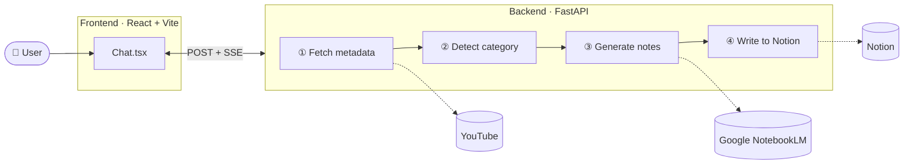

# All-in-One

A modular knowledge capture hub that automates converting multimedia content into structured Notion pages. Currently features a **YouTube → Notion** pipeline with streaming real-time feedback.

---

## Features

- **YouTube → Notion:** Paste a YouTube URL → get a fully structured Notion page with AI-generated notes
- **NotebookLM-powered:** Google NotebookLM processes the video and generates notes — no local GPU or transcription required
- **Streaming UI:** Real-time progress updates via Server-Sent Events as each pipeline stage completes
- **Category-aware routing:** Videos are auto-detected as General, Technology, or Stocks and routed to the matching NotebookLM notebook

---

## Demo


---

## Architecture



### Pipeline Flow

1. User pastes a YouTube URL in the chat input
2. Backend fetches video metadata via `yt-dlp` → streams `progress` event
3. Category is auto-detected from title/channel/description keywords → streams `category_detected` event
4. User confirms or overrides the category in the UI
5. Frontend re-submits with confirmed category
6. Video URL is added as a source to the matching **NotebookLM** notebook (`nlm source add --youtube --wait`)
7. NotebookLM is queried for comprehensive notes on the video (`nlm query notebook`)
8. Notion page is created with the AI-generated notes → streams `done` event with page URL
9. Frontend displays a success card with a direct link to the Notion page

### Categories & Notebooks

Each video is routed to one of three persistent NotebookLM notebooks based on auto-detected category:

| Category | NotebookLM Notebook | Auto-detected from |
|---|---|---|
| **General** | General | tutorial, guide, learn, walkthrough, etc. |
| **Technology** | Technology | python, react, docker, API, machine learning, etc. |
| **Stocks** | Stocks | ticker, earnings, investing, bull/bear, ETF, etc. |

---

## Tech Stack

| Layer | Technologies |
|---|---|
| Frontend | React 18, TypeScript, Vite 7, Tailwind CSS 3 |
| Backend | Python, FastAPI, Uvicorn, sse-starlette |
| YouTube | yt-dlp |
| Notes | Google NotebookLM via notebooklm-mcp-cli (`nlm`) |
| Notion | notion-client |

---

## Prerequisites

- **Node.js** (v18+)
- **Python** (3.10+)
- **notebooklm-mcp-cli** — install via uv: `uv tool install notebooklm-mcp-cli`, then authenticate with `nlm login`
- A **Google account** with access to [NotebookLM](https://notebooklm.google.com)
- A **Notion integration token** and a target **database ID**

---

## Setup

### 1. Clone and install

```bash
git clone <repo-url>
cd All-in-one
```

**Backend:**

```bash
cd backend
python -m venv .venv
.venv\Scripts\activate          # Windows
# source .venv/bin/activate     # macOS/Linux

pip install -r requirements.txt
```

**Frontend:**

```bash
cd frontend
npm install
```

### 2. Configure environment variables

```bash
cp backend/.env.example backend/.env
```

Edit `backend/.env`:

```env
NOTION_API_KEY=secret_...
NOTION_DATABASE_ID=...
```

To get these values:
1. Go to [https://www.notion.so/my-integrations](https://www.notion.so/my-integrations) and create an integration
2. Copy the **Internal Integration Token** as `NOTION_API_KEY`
3. Create a Notion database, share it with your integration, and copy the database ID from the URL as `NOTION_DATABASE_ID`

**NotebookLM authentication** (one-time):

```bash
nlm login
```

This opens a browser to authenticate with your Google account. The three category notebooks (General, Technology, Stocks) are created automatically on first backend startup.

### 3. Set up the Notion database

Create a database in Notion with the following properties exactly as named:

| Property | Type | Notes |
|---|---|---|
| **Title** | Title | Page title (video title) |
| **Category** | Select | Options: `General`, `Technology`, `Stocks` |
| **Channel** | Rich text | YouTube channel name |
| **URL** | URL | Link to the original YouTube video |
| **Date Watched** | Date | Auto-set to today's date |

Each page body contains a **Metadata** block (title, channel, URL, date) followed by a **Notes** section with the AI-generated content from NotebookLM, rendered with proper headings, bullet points, and bold text.

Once the database is created, share it with your integration:
1. Open the database in Notion
2. Click `...` (top-right) → **Connections**
3. Search for your integration name and click **Confirm**

To verify the Notion connection is wired up correctly, run the test script:

```bash
cd backend
.venv\Scripts\activate
python test_notion.py
```

---

## Running

Start both servers in separate terminals:

**Terminal 1 — Backend:**

```bash
cd backend
.venv\Scripts\activate
python -m uvicorn main:app --reload
# Runs on http://localhost:8000
# API docs at http://localhost:8000/docs
```

**Terminal 2 — Frontend:**

```bash
cd frontend
npm run dev
# Runs on http://localhost:5173
```

Open [http://localhost:5173](http://localhost:5173) in your browser.

---

## Project Structure

```
All-in-one/
├── backend/
│   ├── main.py                   # FastAPI app + NotebookLM startup
│   ├── requirements.txt
│   ├── .env.example              # Environment variable template
│   ├── .notebooks.json           # Auto-generated: cached NotebookLM notebook IDs
│   ├── routes/
│   │   └── youtube_to_notion.py  # POST /api/youtube-to-notion (SSE stream)
│   └── services/
│       ├── youtube.py            # yt-dlp metadata fetch
│       ├── categorizer.py        # Keyword-based category detection
│       ├── notebooklm.py         # nlm CLI wrapper — add source + query
│       └── notion.py             # Notion API page creation
├── frontend/
│   ├── index.html
│   ├── vite.config.ts            # Dev server + proxy to :8000
│   └── src/
│       ├── main.tsx              # React root
│       ├── App.tsx               # Tool router
│       └── components/
│           ├── Sidebar.tsx       # Collapsible tool navigation
│           └── tools/YoutubeToNotion/
│               ├── Chat.tsx      # SSE streaming chat UI
│               └── Message.tsx   # Message type components
└── .interface-design/
    └── system.md                 # Design system (colors, tokens, patterns)
```

---

## API Reference

### `POST /api/youtube-to-notion`

Streams Server-Sent Events as the pipeline runs.

**Request body:**

```json
{
  "url": "https://www.youtube.com/watch?v=...",
  "category": "Educational"   // optional; omit to trigger auto-detection
}
```

**SSE event types:**

| Event | Payload | Description |
|---|---|---|
| `progress` | `{ "message": "..." }` | A pipeline stage is running |
| `category_detected` | `{ "category": "...", "title": "...", "channel": "..." }` | Auto-detected category (pauses for user confirmation) |
| `done` | `{ "notionUrl": "https://notion.so/..." }` | Notion page created successfully |
| `error` | `{ "message": "..." }` | Pipeline failure |

---

## Adding New Tools

The app is designed as an extensible hub:

1. Add a new component under `frontend/src/components/tools/<ToolName>/`
2. Register it in `App.tsx` tool router and `Sidebar.tsx` navigation
3. Add a new route under `backend/routes/<tool_name>.py`
4. Register the route in `backend/main.py`
